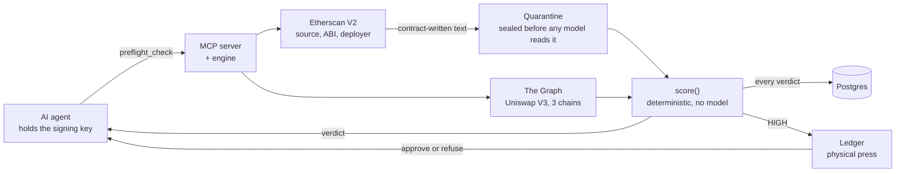

  

  <picture>
    <source media="(prefers-color-scheme: dark)" srcset="https://readme-typing-svg.demolab.com?font=JetBrains+Mono&weight=600&size=24&duration=2600&pause=1800&center=true&vCenter=true&width=720&height=50&lines=Hey,+I%27m+Ritik+Lakhwani;Realtime+systems+and+distributed+backends;AI+agent+infra+and+onchain+data&color=E6EDF3">
    
  </picture>

  Full-stack engineer, obsessed with scaling backends and infra.

  &nbsp;&nbsp;
  &nbsp;&nbsp;
  &nbsp;&nbsp;
  

---

### &nbsp; Hackathons &nbsp;8 hackathons · prizes at 4

| Result | Event | Project | What was hard |
|:--|:--|:--|:--|
| **Prize winner** | ETHOnline 2026 | [Preflight](https://github.com/ritiklakhwani/preflight) | Judging contracts by on-chain history, not by text the deployer wrote |
| **$2,000** | ETHGlobal Bangkok 2024 | [ZK Credit Score](https://github.com/ritiklakhwani/zk-credit-score-eth-global-bangkok) [showcase](https://ethglobal.com/showcase/zk-credit-score-pa7r4) | Cross-chain balance proofs with vlayer Teleport that keep balances private |
| **Pool prize** | ETHGlobal Singapore 2024 | [Inspector AI](https://github.com/Krane-Apps/inspector-ai-eth-singapore-2024) [showcase](https://ethglobal.com/showcase/inspector-ai-s5mw5) | Contract risk scoring across chains, with World ID keeping reviews Sybil-resistant |
| Built | ETHGlobal Open Agents 2026 | [TamaTown](https://github.com/ritiklakhwani/eth-open-agents) | One process and one P2P node per agent, under a single supervisor |
| Built | SCBC 2026 | [AgentMarketplace](https://github.com/ritiklakhwani/agent-marketplace) | Agents paying each other per call in USDC over x402, with reputation-weighted bidding |
| Built | Solana Monolith 2026 | [Degen Derby](https://github.com/ritiklakhwani/degen-derby) | Live memecoin prices driving a race in real time, with parimutuel SOL payouts |

Also: ETHOnline 2024, [BlockGood](https://ethglobal.com/showcase/blockgood-qha9s) (Sign Protocol pool prize) · ETHGlobal New Delhi 2025, [WalShare](https://ethglobal.com/showcase/walshare-sfg9s)

---

### &nbsp; Projects

<table>
<tr>
<td width="50%" valign="top">
<b><a href="https://github.com/ritiklakhwani/preflight">Preflight</a></b> 
The check an AI agent runs before it signs. Scores a contract on its on-chain history and sends risky approvals to a Ledger. 
~12 s per verdict · 11 checks · 3 chains · 167 tests 
TypeScript · MCP · PostgreSQL · The Graph · Ledger
</td>
<td width="50%" valign="top">
<b><a href="https://github.com/ritiklakhwani/real-time-data-aggregation-service">Realtime DEX Data Aggregator</a></b> 
DexScreener and Jupiter merged into one live token feed, cached in Redis and pushed to clients over WebSockets. 
2 s cycle · 2 sources · 4 services sharing only Redis 
TypeScript · Redis pub/sub · ws · Express · Docker
</td>
</tr>
<tr>
<td width="50%" valign="top">
<b><a href="https://github.com/ritiklakhwani/eth-open-agents">TamaTown</a></b> 
Persistent AI agents as transferable NFTs, each running as its own process and P2P node, acting for its owner on-chain. 
1 process + 1 P2P node per agent · 4 contracts · 5 workflow types 
Fastify · Socket.IO · SQLite · Foundry · viem · Claude
</td>
<td width="50%" valign="top">
<b><a href="https://github.com/ritiklakhwani/agent-marketplace">AgentMarketplace</a></b> &nbsp; 
AI agents bid in a Dutch auction, hire specialist agents and pay each other in USDC over x402 on Solana. 
2 Anchor programs · reputation-weighted bids · insurance vault 
Anchor · Next.js · x402 · USDC · Circle CCTP
</td>
</tr>
<tr>
<td width="50%" valign="top">
<b><a href="https://github.com/ritiklakhwani/csv-to-crm-ai-pipeline">CSV to CRM</a></b> &nbsp; 
Maps any lead CSV onto a fixed CRM schema with a two-phase LLM pipeline and a validator that trusts nothing. 
25-row batches, 4 in flight · 3 attempts per batch · 15 fields 
Express · OpenAI · Zod · SSE · Next.js
</td>
<td width="50%" valign="top">
<b><a href="https://github.com/ritiklakhwani/notification-microservice">Notification microservice</a></b> 
The API publishes an event and returns. A separate service renders and delivers email from priority queues. 
3 priority queues · SET NX dedupe per job · non-blocking API 
Bun · Redis · PostgreSQL · Prisma · Resend
</td>
</tr>
</table>

<b>Demos and architecture</b>

 

**Preflight**: how a verdict is made

**Realtime DEX Data Aggregator**

https://github.com/user-attachments/assets/e54436c3-9675-4eb6-ab80-389c69d1f09c

**CSV to CRM**

https://github.com/user-attachments/assets/68c84078-4243-4c73-85dd-7d3101548503

---

### &nbsp; Stack

<table>
<tr>
<td><b>Backend</b></td><td>Node.js, TypeScript, Bun, Express, Fastify, WebSockets, SSE</td>
<td><b>Data</b></td><td>PostgreSQL, Prisma, Redis, MongoDB, SQLite</td>
</tr>
<tr>
<td><b>Infra</b></td><td>Docker, Nginx, Linux, Cloudflare</td>
<td><b>Applied AI</b></td><td>MCP servers, OpenAI and Anthropic SDKs, structured outputs</td>
</tr>
<tr>
<td><b>Chain</b></td><td>Solidity, Foundry, viem, The Graph, Solana</td>
<td><b>Frontend</b></td><td>React, Next.js, Tailwind</td>
</tr>
</table>

---

<picture>
  <source media="(prefers-color-scheme: dark)" srcset="https://raw.githubusercontent.com/ritiklakhwani/ritiklakhwani/output/github-snake-dark.svg">
  
</picture>
