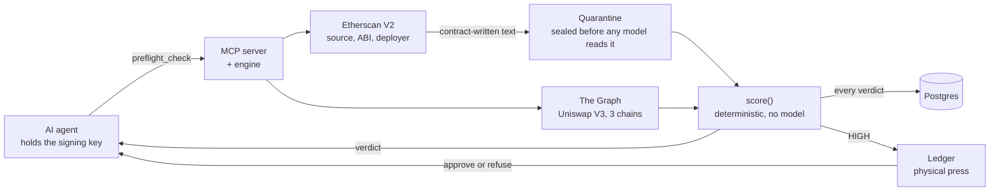

  <picture>
    <source media="(prefers-color-scheme: dark)" srcset="https://readme-typing-svg.demolab.com?font=JetBrains+Mono&weight=500&size=22&duration=3000&pause=1200&color=FFFFFF&center=true&vCenter=true&width=700&height=45&lines=Ritik+Lakhwani+%C2%B7+backend+engineer;Real-time+pipelines+and+agent+infrastructure;Node.js+%C2%B7+TypeScript+%C2%B7+Postgres+%C2%B7+Redis+%C2%B7+Solidity">
    
  </picture>

  Backend engineer building real-time pipelines and the infrastructure AI agents run on, with prizes at ETHOnline 2026 and ETHGlobal Bangkok ($2,000).

---

## Hackathons

Six ETHGlobal hackathons, prizes at four.

| Result | Event | Project | The hard part | Links |
|---|---|---|---|---|
| **Prize winner** | ETHOnline 2026 | [Preflight](#preflight) | Judging a contract by what it has done on-chain, not what its source claims, while keeping contract-written text from steering the agent that reads the verdict. | [repo](https://github.com/ritiklakhwani/preflight) |
| **$2,000** vlayer + Blockscout prizes | ETHGlobal Bangkok 2024 | ZK Credit Score | Cross-chain balance proofs with vlayer Teleport, so a lender can verify a 300 to 850 score without seeing the balances behind it. | [repo](https://github.com/ritiklakhwani/zk-credit-score-eth-global-bangkok) · [showcase](https://ethglobal.com/showcase/zk-credit-score-pa7r4) |
| Built | ETHGlobal Open Agents 2026 | [PetCity](#petcity) | One OS process and one P2P node per agent under a single supervisor, each agent a transferable ERC-7857 iNFT with its own wallet. | [repo](https://github.com/ritiklakhwani/eth-open-agents) |

Earlier: ETHGlobal Singapore 2024, [Inspector AI](https://ethglobal.com/showcase/inspector-ai-s5mw5), Worldcoin pool prize (rebuilt as Preflight) · ETHOnline 2024, [BlockGood](https://ethglobal.com/showcase/blockgood-qha9s), Sign Protocol pool prize · ETHGlobal New Delhi 2025, [WalShare](https://ethglobal.com/showcase/walshare-sfg9s)

---

## Projects

### Preflight

The check an AI agent runs before it signs. An MCP server that scores a contract on its Uniswap V3 history across Ethereum, Arbitrum and Base, and sends high-risk approvals to a Ledger for a physical button press.

**Numbers** &nbsp; about 12 s per verdict with 11 of 11 checks · one Graph query cut from 13 s to 5.8 s by splitting it into parallel requests · 167 tests 
**Stack** &nbsp; TypeScript · MCP · PostgreSQL · The Graph · Etherscan V2 · Ledger 
[Repo](https://github.com/ritiklakhwani/preflight)

### Solana market pipeline

DexScreener and Jupiter merged into one token feed every 2 seconds, cached in Redis and pushed to clients over WebSockets. Four services that share nothing but Redis, so each one restarts or scales on its own.

https://github.com/user-attachments/assets/e54436c3-9675-4eb6-ab80-389c69d1f09c

**Numbers** &nbsp; 2 sources merged every 2 s · 4 independently deployable services · one failing source never fails a cycle 
**Stack** &nbsp; TypeScript · Redis pub/sub · ws · Express 5 · Docker Compose 
[Repo](https://github.com/ritiklakhwani/real-time-data-aggregation-service)

### PetCity

Persistent AI agents that live 24/7, each one a transferable NFT running as its own process and peer-to-peer node, acting for its owner through scheduled on-chain workflows.

**Numbers** &nbsp; 4 contracts on Sepolia · 1 process and 1 P2P node per agent · 5 on-chain workflow types · large-model calls capped at 5 per agent per day 
**Stack** &nbsp; Fastify · Socket.IO · SQLite · Foundry · viem · Anthropic SDK · Gensyn AXL · 0G Storage 
[Repo](https://github.com/ritiklakhwani/eth-open-agents)

### CSV to CRM pipeline

Maps any lead CSV onto a fixed 15-field CRM schema with a two-phase LLM pipeline, then validates every record on the assumption that the model is wrong.

https://github.com/user-attachments/assets/68c84078-4243-4c73-85dd-7d3101548503

**Numbers** &nbsp; 25-row batches, 4 in flight · up to 3 attempts per batch, halved on token overflow · every extracted email and phone must appear verbatim in the source row 
**Stack** &nbsp; Express 5 · OpenAI structured outputs · Zod · SSE · Next.js 
[Repo](https://github.com/ritiklakhwani/csv-to-crm-ai-pipeline) · [Live](https://csv-to-crm-ai-pipeline-frontend.vercel.app/)

### Notification service

The API publishes an event and returns. A separate service fans it out per recipient, renders the template and drains priority queues through Resend, so no request ever waits on email.

**Numbers** &nbsp; 3 priority queues · 1 SET NX claim per recipient job, so a replayed event cannot send twice 
**Stack** &nbsp; Bun · Redis · PostgreSQL · Prisma · Resend 
[Repo](https://github.com/ritiklakhwani/notification-microservice)

More

 

- [AgentBazaar](https://github.com/ritiklakhwani/agent-marketplace): AI agents bid, compose and pay each other in USDC over x402 on Solana. [Live](https://agentbazaar.oceandev.xyz/)
- [web3-realtime-stream-proxy](https://github.com/ritiklakhwani/web3-realtime-stream-proxy): Backpack Exchange's WebSocket feed, filtered and fanned out to clients by subscription.
- [solana-wallet-monitor](https://github.com/ritiklakhwani/solana-wallet-monitor): Rust service that watches Solana balance changes and analyzes the transactions behind them with an LLM.

---

## Stack

| Layer | Tools |
|---|---|
| Runtime | Node.js, TypeScript, Bun, Express, Fastify |
| Data | PostgreSQL, Prisma, Redis, MongoDB, SQLite |
| Real-time | WebSockets, Socket.IO, SSE, Redis pub/sub |
| Infra | Docker, Nginx, Linux, Cloudflare |
| Applied AI | MCP servers, OpenAI and Anthropic SDKs, schema-validated model output |
| Chain | Solidity, Foundry, viem, The Graph, Solana |
| Frontend | React, Next.js, Tailwind |

---

<picture>
  <source media="(prefers-color-scheme: dark)" srcset="https://raw.githubusercontent.com/ritiklakhwani/ritiklakhwani/output/github-snake-dark.svg">
  
</picture>

  <a href="https://oceandev.xyz">oceandev.xyz</a> · <a href="mailto:ritiklakhwani28@gmail.com">ritiklakhwani28@gmail.com</a> · <a href="https://x.com/ritiklakhwani">X</a> · <a href="https://www.linkedin.com/in/ritiklakhwani">LinkedIn</a>

